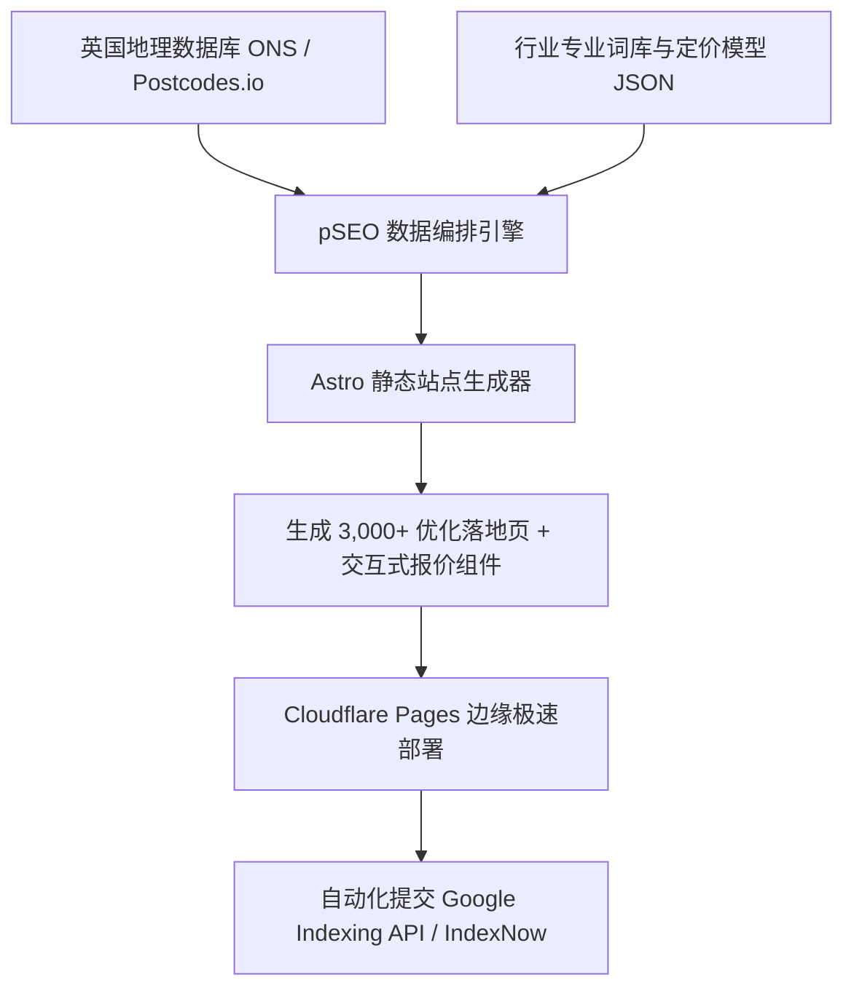

# 03. 端到端自动化建站与程序化 SEO (pSEO) 技术架构

## 1. 架构总览

本流水线设计用于在 **15 分钟内** 从零生成一个覆盖英国 300+ 城镇、包含数千个高权重本地落地页的现代静态服务平台。

---

## 2. 核心模块分解

### 2.1 数据层（Data Layer）
* **地理数据源**：
  * 英国国家统计局（ONS）与 `postcodes.io` 开放 API。
  * 包含字段：`Town Name`, `Postcode District (e.g. RG1)`, `County`, `Latitude/Longitude`, `Population`, `Affluence Tier`。
* **行业参数建模**：
  * 每个行业设定独立的配置表（如基础工时费、每平米工料均价、施工周期、常见品牌型号）。

### 2.2 生成层（pSEO Generation via Astro）
* **为什么选择 Astro？**
  * 零运行时 JS 膨胀，首屏加载速度（TTFB）低于 50ms。
  * 原生支持 `getStaticPaths()` 批量渲染成千上万个静态 HTML 文件。
* **URL 路由规划**：
  * `/[service]/[city]` -> 例：`/tiler/reading`
  * `/[service]/[postcode-district]` -> 例：`/emergency-locksmith/sw1a`
  * `/services/[sub-service]-[city]` -> 例：`/services/bathroom-tiling-bristol`
  * `/pricing` -> 英国各区域价格透明对比表
  * `/quote` -> 智能多步线索收集表单

### 2.3 动态差异化防惩罚机制（Anti-Doorway Mechanism）
为了通过 Google 严苛的实用内容系统（Helpful Content System），页面动态注入 4 项真实差异要素：
1. **真实距离计算**：根据经纬度自动列出当前城市半径 8 英里内的 10 个邻近乡村/小镇。
2. **区域价格调整系数**：根据邮编自动匹配大伦敦区（+30% 工时）、东南部（+15%）及中北部基准价。
3. **本地化建筑结构说明**：动态匹配该地区的典型房型（Victorian, Edwardian, Semi-detached）。
4. **完整 Schema.org 结构化标记**：输出 `LocalBusiness`, `Service`, `AggregateRating`, `FAQPage`。